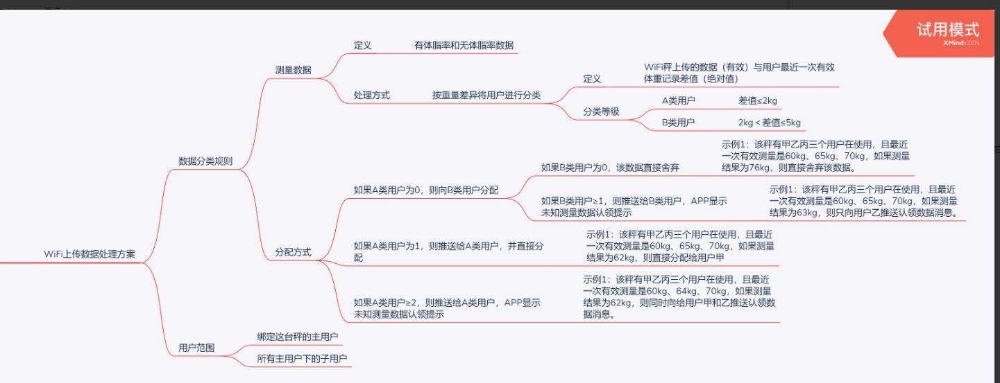

# Dual-mode scale access guide

## Introduction

The "dual-mode scale" mentioned here refers to a body fat scale with two data transmission functions of WiFi and Bluetooth

## Role

### Bluetooth

Used to set the ssid and password of WiFi

Used for data transmission during weighing

### WiFi

Weighing data transmission

## WiFi usage process

### first time using

When first used

#### 1. Scan the device

Call the API of ordinary Bluetooth scale, scan to Yolanda Bluetooth device (QNBleDevice), and judge whether the value of `isSupportWifi` is true, if true, it supports Wifi function.

#### 2. Register the device

The WiFi device needs to be registered with the server, call the API [Register WiFi Bluetooth Dual Mode Device with Yolanda Cloud](../api/QNBleApi.md#registerwifibledevice)

> This method requires a network, please ensure that the method is successfully executed, otherwise the cloud cannot receive the measurement data forwarded by our cloud
> The method can be successfully executed once, but there are no adverse effects many times

#### 3. Configure WiFi

The ssid and password of WiFi are not saved on the scale side when leaving the factory. At this time, you need to call the relevant Bluetooth app to configure the scale side

> Configuration API Please check [Configure WiFi Bluetooth Dual Mode Device](../api/QNBleApi.md#connectdevicesetwifi)

## 4. Write network interface

Provide the address prefix of the customer's cloud server, such as: http://www.baidu.com/scale/

> The following collectively refers to our company server as:Yolanda Cloud, the customer's server is: Merchant Cloud

### Ask user information interface

#### Scenes

Prerequisites: The scale has been successfully registered, the scale has been networked, and Bluetooth is not connected during measurement

At this time, the data will be uploaded to the Yolanda cloud via WiFi, and then Yolanda cloud will forward the relevant information such as weight and measurement time to the merchant cloud.

At this time, the merchant cloud needs to query the user who is bound to the device in the service, and pass the user information back to the Yolanda cloud, and then Yolanda combines the user information for calculation and then passes the data through [Push measurement data service]).

#### Basic

Interface address: prefix + user_info, example: address is http://www.baidu.com/accept/user_info where `user_info` is appended to the provided interface address prefix

Request method: `GET`

> Under normal circumstances, it will not be sent again after a successful response, and will not be resent if it fails.

#### Request parameters

|Field name|variable name|Required|Types of|Example values|description|
| :------- | :----------- | :--- | :----- | :------------------ | :------------------------------------------------------ |
|body weight| weight       |Yes| Double | 58.8                | kg                                                      |
|measure time| measure_time |Yes| Data   | 2019-04-29 15:21:18 |                                                         |
| mac      | mac          |Yes| String | F0:FE:6B:CB:75:6A   |                                                         |
|Model ID| model_id     |Yes| String | 0000                |                                                         |
|Data information| hmac         |Yes| String |                     |This can be used later to generate measurement data, corresponding to the `hmac` field in the SDK|
|signature| sign         |Yes| String |JSON format|Signature, see signature algorithm for details|

#### Return data

|Field name|variable name|Required|Types of|Example values|description|
| :--------- | :-------------- | :--- | :----- | :--------- | :--- |
|Return status| status          |Yes| String | 20000      |      |
|height| height          |Yes| Double | 176.7      | cm   |
|gender| gender          |Yes| int    |0 female 1 male|      |
|birthday| birthday        |Yes| Data   | 1986-01-01 |      |
|Body type| user_shape      |no| int    | 3          |      |
|aims| user_goal       |no| int    | 4          |      |
|Clothes weight| clothing_weight |no| Double | 1.2        | kg   |
|Whether an athlete| sport_flag      |no| int    |0 no 1 yes|      |
|User ID| user_id         |Yes| String | 1001       |      |

Examples are as follows:

```json
{
  "status": "20000",
  "user_info": {
    "height": 160.0,
    "gender": 0,
    "birthday": "1986-01-01",
    "user_shape": 0,
    "user_goal": 0,
    "clothing_weight": 0,
    "sport_flag": 0
  }
}
```

If no user is matched, there is no user_info key

### Push measurement data service

#### Scenes

After receiving the user data returned by the merchant cloud, Yolanda Cloud will calculate the physical data, and then push the data to the merchant cloud through this interface

#### Basic

Interface address: prefix + measure, example: address is http://www.baidu.com/accept/measure where `measure` is added to the provided interface address prefix

Request method: `POST`

> During the notification interaction, if Yolanda received a response from the partner that was not successful or timed out, Yolanda believes that the notification failed, and Yolanda will periodically re-initiate the notification through certain strategies to increase the success rate of the notification as much as possible, but Yolanda does not guarantee that the notification will eventually succeed. (Notification frequency is 15/30/180/1800/3600, unit: second)
> In addition, under normal circumstances, the response will not be sent again, and in the case of failure, the same notification may be sent to the partner system multiple times. The partner system must be able to handle duplicate notifications correctly.

#### Request parameters

|Field name|variable name|Required|Types of|Example values|description|
| :--------- | :--------- | :--- | :----- | :-------------------- | :----------------------- |
|Partner ID| partner_id |Yes| String | qn888888              |Partner ID assigned by Yolanda|
|status code| code       |Yes| String | 20000                 |success failure|
|returned messages| msg        |no| String | success/fail          |A specific description of success or error|
|Index content| resultData |Yes| String |JSON format data, see the table below|Specific information of measured indicators|
|Random string| nonce_str  |Yes| String | 067428733252          |Random string, no more than 32 bits|
|signature| sign       |Yes| String |JSON format|Signature, see signature algorithm for details|

|Field name|variable name|Required|Types of|Example values|description|
| :------- | :------------- | :--- | :----- | :------------------ | :---------------------------------------------------------------- |
|User ID| user_id        |Yes| String | qn888888            |Partner ID assigned by Yolanda|
|measure time| measurement_at |Yes| String | 2019-04-30 15:48:53 |Specific information of measured indicators|
| mac      | mac            |Yes| String | F0:FE:6B:CB:75:6A   |                                                                   |
|model| model_id       |Yes| String | 0000                |                                                                   |
|Indicator array| item_list      |Yes| String |Array format| type:[Indicator constant](../attouched_list/body_indexes.md) value:Index value|

Examples are as follows

```
{
"code" : "20000", "msg" : "success", "partner_id" : "ade2e33efefdvdf", "resultData" : "{\"measurement_at\":\"2019-04-30 18:22:53\",\"user_id\":1001,
\"mac\":\"F0:FE:6B:CB:75:6A\",\"model_id\":\"0005\",
\"item_list\":[{\"type\":1,\"value\":25.35},{\"type\":2,\"value\":9.9},{\"type\":3,\"value\":5.1},{\"type\":4,\"value\":4.7},{\"type\":5,\"value\":1},{\"type\":6,\"value\":74.5},{\"type\":7,\"value\":63.2},{\"type\":8,\"value\":16.5},{\"type\":9,\"value\":90.0},{\"type\":11,\"value\":13.7},{\"type\":16,\"value\":93}]}",
"nonce_str" : "067428733252",
"sign" : "ef2b9e9a4dc03f764e033947859dedd3"
}
```

#### Return parameter

Just return success/fail

### Signature algorithm

The digital interaction between Yolanda and the partner system will be added with digital signatures.Currently, only MD5 is supported.When signing, you need to use the secret assigned when you enter Yolanda (when you enter Yolanda, a pair of partner_id/secret will be assigned, where
secret is for signature, please keep the key distributed by Yolanda properly)
Signing parameters: In the Yolanda request parameter list, except for the sign parameter, all other parameters that need to be used are the parameters to be signed.
The steps for signature generation are as follows:

1. Put these parameters into a Map and remove the signature parameters:sign
1. Sort the remaining parameters in ascending order of the letters of the key (from a to z, if they encounter the same first letter, look at the second letter, and so on)
1. After sorting, press key&The value key-value pair format is concatenated into a string stringA, and the data with empty value is removed.
1. Combine the secrets assigned to the above strings into a new string
1. Use MD5 to sign the assembled string and verify that the signature is the sign in the parameters.

Pay special attention to the following important rules:

1. If the value of the parameter is empty, do not participate in the signature；
2. When the verification call returns or actively informs the signature, the transferred sign parameter does not participate in the signature, and the generated signature is checked against the sign value.
3. The Yolanda interface may add fields, and the extended fields must be supported when verifying the signature

Examples:
Requested parameters:

```json
{
  "partner_id": "1111",
  "user_code": "921026",
  "nonce_str": "11eeewwwwwq112s",
  "sign": "a328c2ec0a60cbbc9961a1189f61e97b"
}
```

splice:
stringA = “nonce_str=11eeewwwwwq112s&partner_id=1111&user_code=921026”
Splice the secret: ekskdsd8sd88s833 and then "nonce_str = 11eeewwwwwq112s&partner_id=1111&user_code=921026ekskd sd8sd88s833"
MD5 signature value:
a328c2ec0a60cbbc9961a1189f61e97b

### In daily use

#### Schematic diagram of WIFI data interaction timing

**Flow during normal measurement**

as follows:

<iframe src="https://mermaidjs.github.io/mermaid-live-editor/#/view/eyJjb2RlIjoic2VxdWVuY2VEaWFncmFtXG5wYXJ0aWNpcGFudCBzY2FsZSBhcyDnp6RcbnBhcnRpY2lwYW50IHFuIGFzIOi9u-eJm-S6kVxucGFydGljaXBhbnQgY3MgYXMg5a6i5oi35LqRXG5wYXJ0aWNpcGFudCBhcHAgYXMgQVBQXG5cblxuc2NhbGUtPj5xbjog5LiK5Lyg5rWL6YeP5pWw5o2uXG5xbi0-PmNzOiDovazlj5HmtYvph4_mlbDmja5cbmNzLT4-Y3M6IOafpeWIsOe7keWumuiuvuWkh-eahOeUqOaIt1xucW4tLT5xbjog6Zi75aGe562J5b6F5a6i5oi35LqR5Zue5Lyg55So5oi35L-h5oGvXG5jcy0-PnFuOiDlm57kvKDnlKjmiLfotYTmlplcbnFuLT4-cW46IOiuoeeul-eUqOaIt-aVsOaNrlxucW4tPj5jczog5Zue5Lyg5pWw5o2u5Yiw5a6i5oi35LqRXG5jcy0-PmFwcDog5o6o6YCB5pWw5o2u6IezQVBQIiwibWVybWFpZCI6eyJ0aGVtZSI6ImRlZmF1bHQifX0"  frameborder=0 width=750 height=600></iframe>

1. After the user goes on the scale to measure, the data will be sent to Yolanda Cloud first
2. Yolanda Cloud judges that the device belongs to the customer according to [Register Device Method](../api/QNBleApi.md#registerwifibledevice), and then forwards the data to the cloud address that the customer has filled in.
3. Based on the previous relationship between the device and the user, the customer cloud attempts to determine the owner of the device. If it is determined, the user's information is passed back to Yolanda Cloud.
4. Yolanda Cloud receives the user data returned by the customer's cloud, and then combines the scale data to calculate the complete measurement data.
5. Yolanda Cloud pushes the complete measurement data to the customer cloud.
6. The customer cloud pushes the measurement data to the APP and displays the measurement data to the customer.

**Match to multi-user measurement**
Among the above steps, step `3` may fail to find the measurement user, and the following situation occurs:
1. No user is bound to the device
In this case, the measurement data can be directly discarded, and Qi Niuyun can be played, but the data is not matched.
2. Multiple users are bound to the device at the same time, or multiple users are using the device at the same time. Unable to determine which user is using the scale, you can refer to the following figure, the user identification scheme adopted in our own APP.



3. If you can uniquely determine a user through the scheme above, then follow the normal measurement process. If multiple users are still identified, you can refer to the following process.

<iframe src="https://mermaidjs.github.io/mermaid-live-editor/#/view/eyJjb2RlIjoic2VxdWVuY2VEaWFncmFtXG5wYXJ0aWNpcGFudCBzY2FsZSBhcyDnp6RcbnBhcnRpY2lwYW50IHFuIGFzIOi9u-eJm-S6kVxucGFydGljaXBhbnQgY3MgYXMg5a6i5oi35LqRXG5wYXJ0aWNpcGFudCBhcHAgYXMgQVBQXG5cblxuc2NhbGUtPj5xbjog5LiK5Lyg5rWL6YeP5pWw5o2uXG5xbi0-PmNzOiDovazlj5HmtYvph4_mlbDmja5cbmNzLT4-Y3M6IOafpeWIsOe7keWumuiuvuWkh-eahOeUqOaIt1xucW4tLT5xbjog6Zi75aGe562J5b6F5a6i5oi35LqR5Zue5Lyg55So5oi35L-h5oGvXG5jcy0-PmNzOiDljLnphY3liLDlpJrkuKrnlKjmiLdcbmNzLT4-Y3M6IOaKiuaVsOaNruWFiOS_neWtmOiHs-aVsOaNruW6k1xuY3MtPj5xbjog6YCa55-l5peg5Yy56YWN55So5oi3XG5jcy0-PmFwcDog5o6o6YCB5pWw5o2u6IezQVBQXG5hcHAtPj5hcHA6IOeUqOaIt-iupOmihuaVsOaNrlxuYXBwLT4-YXBwOiDosIPnlKhTREvnlJ_kuqflrozmlbTmtYvph4_mlbDmja5cbmFwcC0-PmNzOiDmiormlbDmja7kv53lrZjoh7PkupHnq68iLCJtZXJtYWlkIjp7InRoZW1lIjoiZGVmYXVsdCJ9fQ"  frameborder=0 width=750 height=650></iframe>

> The method called `call SDK to generate complete measurement data` mentioned above is: [QNScaleStoreData.buildStoreData](../api/QNScaleStoreData.md#buildstoredata)
> The signature in the query user profile interface also needs to be saved and sent to the APP, which is used to call the SDK to produce measurement data.
