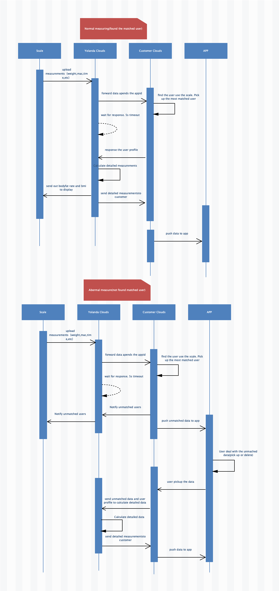

# WiFi+Bluetooth Dual Module Scale Integrate Guide

## Introduction

The WiFi+Bluetooth dual module scale mentioned here refers to the body fat scale with two data transmission functions of WiFi and Bluetooth.

## Connection Mode Action

### Bluetooth

The ssid and password used to set up WiFi

Data transmission for weighing

### WiFi

Weighing data transmission

## WiFi Usage Process

### For the First Time to Use

When first use

#### 1. Scanning Device

Call the API of the normal Bluetooth scale, scan to the Qingniu Bluetooth device (QNBleDevice), and determine that deviceType is equal to SCALE_WIFI_BLE.

#### 2. Register Device

The WiFi device needs to register with the server and call the API to [register the WiFi Bluetooth dual-mode device with the Qingniu cloud.](./api/QNBleApi.md#registerwifibledevice)

> This method requires a network. Please ensure that the method is successfully executed. Otherwise, the cloud cannot receive the measurement data forwarded by our cloud.
> The method performs multiple times without adverse effects.

#### 3. The configuration of WiFi

When the scale is before-delivery, ssid and password of WiFi are not saved at the scale end. At this time, relevant APP of Bluetooth should be called to configure the network at the scale end.

> Distribution Network API[Please check the distribution network of WiFi Bluetooth dual-mode devices.](./api/QNBleApi.md#connectdevicesetwifi)

## 4. Write network API

Provide the address prefix of the client cloud server, such as: ：http://www.example.com/scale/

> Hereinafter collectively referred to as the server of our company: Qingniu cloud, the server of the customer is: Merchant cloud.

### Ask the user data API

#### Scenarios

Pre-conditions: the scale has been successfully registered, the scale has been connected to the network, and no Bluetooth is connected during measurement

At this point, the data will be uploaded to the Qingniu cloud via WiFi, and then the Qingniu Cloud will forward the relevant information such as weight and measurement time to the Merchant Cloud.

At this time, the Merchant Cloud needs to query the user who is bound to the device in the service system, and return the user data to the Qingniu Cloud. And the Qingniu Cloud combines the user data to calculate and then push the data [Push Measurement Data Service](#push-measurement-data-service).

#### Basic Info

API address: prefix + user_info，Example: the address is: http://www.example.com/scale/user_info , where`user_info`is appended to the provided API address prefix.

Request Method：`GET`

> When send request, if Qingniu receive the partner's response is not successful or timeout, Qingniu believes that the notification fails. Qingniu will periodically re-schedule through certain strategies. Initiate a notice to maximize the success rate of the notification, but Qingniu does not guarantee that the notification will eventually succeed (The notification frequency is 15/30/180/1800/3600. Unit: second.).
> In addition, the response will not be sent again after successful response generally. In the case of failure, the same notification may be sent to the partner system multiple times. The partner system must be able to handle duplicate notifications correctly.

#### Request Parameter

| field name         | variable name| Must fill | type  | example value   | description  |
| :---------         | :---------   | :---      | :----- | :-----------   | :------------------------- |
| partner ID         | partner_id   | Y        | String | qn888888        | partner ID assigned by Qingniu |
| status code        | code         | Y        | String | 20000           | success/fail   |
| return information | msg          | N        | String | success         | specific description of success or error |
| index content      | resultData   | Y        | String | 1986            | specific information of measurement indicators |
| random string      | nonce_str    | Y        | String | 067428733252    | random string, no more than 32 bits |
| signature          | sign         | Y        | String | JSON format     | signature, see signature algorithm  |

#### Return Data

| field name      | variable name   | Must fill | type   | example value      | description |
| :---------      | :-------------- | :---      | :----- | :------------      | :--- |
| return status   | status          | Y         | String | 200                |      |
| height          | height          | Y         | Double | 176.7              | cm   |
| gender          | gender          | Y         | int    | 0/1 0 Female 1 Male |      |
| birthday        | birthday        | Y         | Data   | 1986-01-01          |      |
| body shape      | user_shape      | N         | int    | 3                   |      |
| goal            | user_goal       | N         | int    | 4                   |      |
| clothes weight  | clothing_weight | N         | Double | 1.2                 | kg   |
| whether athlete | sport_flag      | N         | int    | 0/1 0 N 1 Y |       |
| user ID         | user_id         | Y         | String | 1001                |      |

An example is as follows:

```json
{
  "status": "20000",
  "user_info": {
    "height": 160.0,
    "gender": 0,
    "birthday": "1986-01-01",
    "user_shape": 0,
    "user_goal": 0,
    "clothing_weight": 0,
    "sport_flag": 0
  }
}
```

If there is no match to the user, there is no user_info key.

### Push Measurement Data Service

#### Scenarios

After receiving the user data returned by the Merchant cloud, Qingniu Cloud will calculate the physical data, and then push the data to the Merchant Cloud through the API.

#### Basic Info

API address: prefix + measure ，Example: the address is http://www.example.com/scale/measure , where`measure`is appended to the provided API address prefix.

Request Method：`GET`

> When send request, if Qingniu receive the partner's response is not successful or timeout, Qingniu believes that the notification fails. Qingniu will periodically re-schedule through certain strategies. Initiate a notice to maximize the success rate of the notification, but Qingniu does not guarantee that the notification will eventually succeed (The notification frequency is 15/30/180/1800/3600. Unit: second.).
> In addition, the response will not be sent again after successful response generally. In the case of failure, the same notification may be sent to the partner system multiple times. The partner system must be able to handle duplicate notifications correctly.

#### Request Parameter

| field name         | variable name| Must fill| type  | example value                        | description  |
| :---------         | :---------   | :---      | :----- | :-----------                        | :------------------------- |
| partner ID         | partner_id   | Y        | String | qn888888                             | partner ID assigned by Qingniu |
| status code        | code         | Y        | String | 20000                                | success/fail   |
| return information | msg          | N        | String | success                              | specific description of success or error |
| index content      | resultData   | Y       | String | JSON format data, see the table below| specific information of measurement indicators |
| random string      | nonce_str    | Y        | String | 067428733252                        | random string, no more than 32 bits |
| signature          | sign         | Y        | String | JSON format                         | signature, see signature algorithm  |

| field name        | variable name  | Must fill | type   | example value      | description |
| :-------          | :------------- | :------- | :----- | :------------------ | :---------------------------             |
| status code       | code           | Y        | String | 20000               | success/fail                             |
| user ID           | user_id        | Y        | String | qn888888            | partner ID assigned by Qingniu           |
| status code       | code           | Y        | String | 20000               | success/fail                             |
| returned messages | msg            | N        | String | success /fail       | specific description of success or error |
| measure time      | measurement_at | Y        | String | 2019-04-30 15:48:53 | Measured indicator specific information |
| mac               | mac            | Y        | String | F0:FE:6B:CB:75:6A   |                              |
| model No          | ID             | model_id | Y      | String              | 0000                         |
| index array       | item_list      | Y        | String | 数组格式            | type:indicator constant  value: index value |

An example is as follows:
```
{
"code" : "20000", "msg" : "success", "partner_id" : "ade2e33efefdvdf", "resultData" : "{\"measurement_at\":\"2019-04-30 18:22:53\",\"user_id\":1001,
\"mac\":\"F0:FE:6B:CB:75:6A\",\"model_id\":\"0005\",
\"item_list\":[{\"type\":1,\"value\":25.35},{\"type\":2,\"value\":9.9},{\"type\":3,\"value\":5.1},{\"type\":4,\"value\":4.7},{\"type\":5,\"value\":1},{\"type\":6,\"value\":74.5},{\"type\":7,\"value\":63.2},{\"type\":8,\"value\":16.5},{\"type\":9,\"value\":90.0},{\"type\":11,\"value\":13.7},{\"type\":16,\"value\":93}]}",
"nonce_str" : "067428733252",
"sign" : "ef2b9e9a4dc03f764e033947859dedd3"
}
```

#### Return Parameter

Return to success/fail

### Signature Algorithm
The data interaction between Qingniu and the partner system will be digitally signed. At present, only the MD5 mode is supported. When signing, you need to use the secret assigned when you enter Qingniu. When you enter Qingniu, you will assign a pair of partner_id /secret, where secret is for the signature, please keep the key assigned by Qingniu).
Parameters involved in the signature: In the list of the Qingniu request parameters, except for the sign parameter, all other parameters that need to be used are the parameters to be signed. The steps to generate a signature are as follows:
1. Put these parameters into a Map and remove the signature parameters: sign (signature)
2. Sort the remaining parameters in ascending alphabetical order of key (ordered from A to Z, if you encounter the same initial, look at the second letter, and so on)
3. After the sorting is completed, press the Key&Value key-value pair to form a string stringA, and remove the data whose value is empty.
4. Put the above string on the back of the allocated secret to form a new string.
5. Sign the assembled string with MD5 and verify that the signature is a sign in the parameter.

Pay special attention to the following important rules:
1. If the value of the parameter is null, it does not participate in the signature.
2. When the verification call returns or actively notifies the signature, the transmitted sign parameter does not participate in the signature, and the generated signature is checked against the sign value.
3. Qingniu API may add fields, and the extended extension field must be supported when verifying the signature.

Example:
Requested parameters:
```json
{
"partner_id":"1111", "user_code":"921026", "nonce_str":"11eeewwwwwq112s",
"sign":"a328c2ec0a60cbbc9961a1189f61e97b"
}
```
Stitching:
stringA = "nonce_str=11eeewwwwwq112s&partner_id=1111&user_code=921026"
stitching up secret:
Ekskdsd8sd88s833 after "nonce_str=11eeewwwwwq112s&partner_id=1111&user_code=921026ekskd sd8sd88s833

MD5 signature value: a328c2ec0a60cbbc9961a1189f61e97b

## WIFI Data Interaction Timing Diagram

