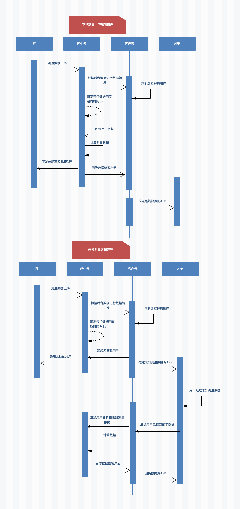

#Double mode scale access guide

## Introduction

The "dual-mode scale" mentioned here refers to the body fat scale with two data transmission functions of WiFi and Bluetooth.

## role

### Bluetooth

The ssid and password used to set up WiFi

Data transmission for weighing

###WiFi

Weighing data transmission

## WiFi Usage Process

### first time using

When first used

#### 1. Scanning device

Call the API of the normal Bluetooth scale, scan to the Bluetooth device (QNBleDevice), and determine that the deviceType is equal to `SCALE_WIFI_BLE`

#### 2. Registering the device

The WiFi device needs to register with the server and call the API [Register WiFi WiFi dual-mode device to Light Niuyun](./api/QNBleApi.md#registerwifibledevice)

> This method requires a network. Please ensure that the method is executed successfully. Otherwise, the cloud cannot receive the measurement data forwarded by our cloud.
> This method is executed multiple times without adverse effects

#### 3. Configuring WiFi

The ssid and password of the WiFi are not saved at the factory. At this time, the relevant APP of Bluetooth needs to be called to distribute the network to the scale.

> Distribution Network API Please see [Distribution Network for WiFi Bluetooth Dual Mode Devices](./api/QNBleApi.md#connectdevicesetwifi)

## 4. Writing a network interface

Provide the address prefix of the client cloud server, for example: http://www.baidu.com/scale/

> The following is a general description of our company's servers: Light Niuyun, the customer's server is: Merchant Cloud

### Asking user data interface

#### Scenes

Pre-conditions: the scale has been successfully registered, the scale has been distributed, and no Bluetooth is connected during measurement.

At this point, the data will be uploaded to the runcobo cloud via WiFi, and then the runcobo will forward the relevant information such as weight and measurement time to the merchant cloud.

At this point, the merchant cloud needs to query the user who is bound to the device in the service, and return the user data to the runcobo cloud, and then calculate the data with the user data and then pass the data through the [push measurement data service](# push measurement data service)

#### Basic

Interface address: prefix +user_info, example: The address is http://www.baidu.com/scale/user_info where `user_info` is appended to the provided interface address prefix.

Request method: `GET`

> When the notification is interactive, if the response received by the partner is not successful or timed out, the runcobo believes that the notification has failed. The runcobo will periodically re-initiate the notification through certain strategies to maximize the success rate of the notification, but the light cattle are not guaranteed. The notice will eventually succeed. (The notification frequency is 15/30/180/1800/3600, unit: second)
> In addition, in general, the response will not be sent again after successful response. In the case of failure, the same notification may be sent to the partner system multiple times. The partner system must be able to handle duplicate notifications correctly.

#### Request Parameters

| Field Name | Variable Name | Required | Type | Example Value |
| :------- | :----------- | :----- | :------------------ | :----- | :--- |
| Weight | double | 58.8 | kg |
Measuring time | measure_time | Data | 2019-04-29 15:21:18 | |
| mac | mac | String | F0:FE:6B:CB:75:6A | |
| Model ID | model_id | String | 0000 | |
| Signature | sign | String | | |

#### Return data

| Field Name | Variable Name | Required | Type | Example Value |
| :--------- | :-------------- | :--- | :----- | :--------- --- | :--- |
| Return Status | status | Yes | String | 200 |
Height | height | yes | Double | 176.7 | cm |
Gender | gender | yes | int | 0/1 0 female 1 male | |
Birthday | birthday | yes | Data | 1986-01-01 | |
Body Type | user_shape | No | int | 3 |
| target | user_goal | no | int | 4 | |
| Clothes Weight | clothing_weight | No | Double | 1.2 | kg |
| athletes | sport_flag | no | int | 0/1 0 no 1 yes |
User ID | user_id | Yes | String | 1001 | |

An example is as follows:

```json
{
  "status": "20000",
  "user_info": {
    "height": 160.0,
    "gender": 0,
    "birthday": "1986-01-01",
    "user_shape": 0,
    "user_goal": 0,
    "clothing_weight": 0,
    "sport_flag": 0
  }
}
```

If there is no match to the user, there is no user_info key

### Push measurement data service

#### Scenes

After receiving the user data returned by the merchant cloud, Light Niu Cloud will calculate the physique data, and then push the data to the merchant cloud through the interface.

#### Basic

Interface address: prefix + measure, example: the address is http://www.baidu.com/scale/measure where `measure` is appended to the provided interface address prefix

Request method: `GET`

> When the notification is interactive, if the response received by the partner is not successful or timed out, the runcobo believes that the notification has failed. The runcobo will periodically re-initiate the notification through certain strategies to maximize the success rate of the notification, but the light cattle are not guaranteed. The notice will eventually succeed. (The notification frequency is 15/30/180/1800/3600, unit: second)
> In addition, in general, the response will not be sent again after successful response. In the case of failure, the same notification may be sent to the partner system multiple times. The partner system must be able to handle duplicate notifications correctly.

#### Request Parameters

| Field Name | Variable Name | Required | Type | Example Value |
| :--------- | :--------- | :--- | :----- | :-------------- ------ | :----------------------- |
| Partner ID | partner_id | Yes | String | qn888888 | Partner of Light Cow Assignment ID |
| Status Code | code | Yes | String | 20000 | Success / Failure |
| Back to Information | msg | No | String | success/fail | Description of Success or Error |
| Indicator Content | resultData | Yes | String | JSON format data, see the table below |
| Random String | nonce_str | Yes | String | 067428733252 | Random String, no more than 32 bits |
Signature | sign | yes | String | JSON format | signature, see signature algorithm |

| Field Name | Variable Name | Required | Type | Example Value |
| :------- | :------------- | :------- | :----- | :-------- ---------- | :--------------------------- |
| Status Code | code | Yes | String | 20000 | Success / Failure |
User ID | user_id | Yes | String | qn888888 | Partner of Light Cow Assignment ID |
| Status Code | code | Yes | String | 20000 | Success / Failure |
| back to information | msg | no | String | success /fail | Description of success or error |
Measurement time | measurement_at | Yes | String | 2019-04-30 15:48:53 | Measurement indicator specific information |
| mac | mac | yes | String | F0:FE:6B:CB:75:6A | |
| Model | ID | model_id | Yes | String | 0000 |
| indicator array | item_list | yes | String | array format | type: indicator constant value: indicator value |

Examples are as follows

```
{
"code" : "20000", "msg" : "success", "partner_id" : "ade2e33efefdvdf", "resultData" : "{\"measurement_at\":\"2019-04-30 18:22:53\" , \"user_id\":1001,
\"mac\":\"F0:FE:6B:CB:75:6A\",\"model_id\":\"0005\",
\"item_list\":[{\"type\":1,\"value\":25.35},{\"type\":2,\"value\":9.9},{\"type\": 3,\"value\":5.1},{\"type\":4,\"value\":4.7},{\"type\":5,\"value\":1},{\" Type\":6,\"value\":74.5},{\"type\":7,\"value\":63.2},{\"type\":8,\"value\":16.5} , {\"type\":9,\"value\":90.0},{\"type\":11,\"value\":13.7},{\"type\":16,\"value\ ":93}]}",
"nonce_str" : "067428733252",
"sign" : "ef2b9e9a4dc03f764e033947859dedd3"
}
```

#### Return parameters

Return success/fail

### Signature Algorithm

The data interaction between the runcobo and the partner system will be digitally signed. At present, only the MD5 mode is supported. When signing, you need to use the secret assigned when you enter the runcobo. When you enter the runcobo, a pair of partner_id /secret is assigned.
The secret is used for signing, please keep the key assigned by the runcobo.
Parameters involved in the signature: In the list of the light cattle request parameters, except for the sign parameter, all other parameters that need to be used are the parameters to be signed.
The steps to generate a signature are as follows:

1. Put these parameters into a Map and remove the signature parameters: sign (signature)
1. Sort the remaining parameters in ascending alphabetical order of key (ordered from a to z, if you encounter the same initial, look at the second letter, and so on)
1. After the sorting is completed, press the key&value key-value pair to form a string stringA, and remove the data whose value is empty.
1. Put the above string on the back of the allocated secret to form a new string
1. Sign the assembled string with MD5 and verify that the signature is sign in the parameter.

Pay special attention to the following important rules:

1. If the value of the parameter is null, it does not participate in the signature;
2. When the verification call returns or actively notifies the signature, the transmitted sign parameter does not participate in the signature, and the generated signature is checked against the sign value.
3. The runcobo interface may add fields, and the extended extension field must be supported when verifying the signature.

Example:
Requested parameters:

```json
{
  "partner_id": "1111",
  "user_code": "921026",
  "nonce_str": "11eeewwwwwq112s",
  "sign": "a328c2ec0a60cbbc9961a1189f61e97b"
}
```

splice:
stringA = "nonce_str=11eeewwwwwq112s&partner_id=1111&user_code=921026"
Splicing on secret :ekskdsd8sd88s833 after "nonce_str=11eeewwwwwq112s&partner_id=1111&user_code=921026ekskd sd8sd88s833"
MD5 signature value:
A328c2ec0a60cbbc9961a1189f61e97b

## WIFI Data Interaction Timing Diagram

