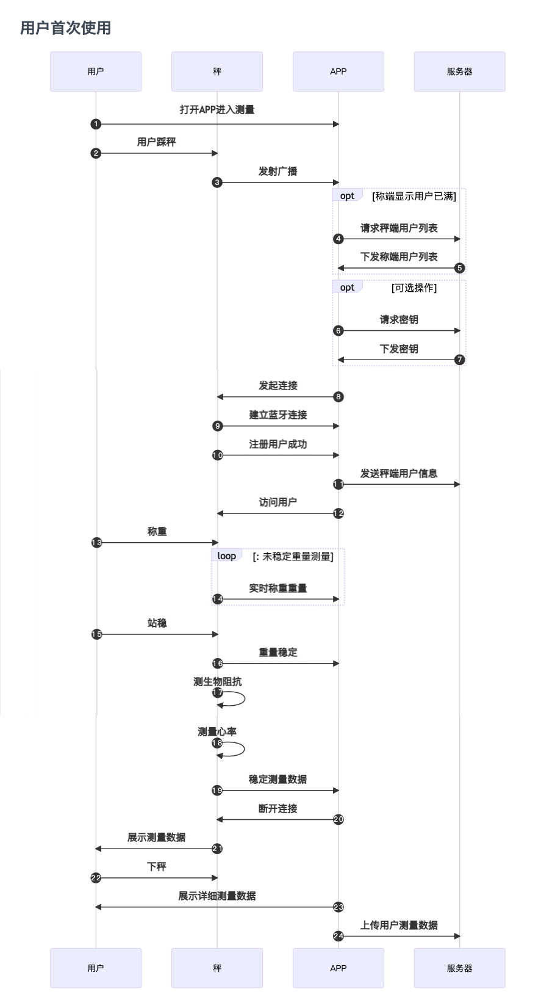
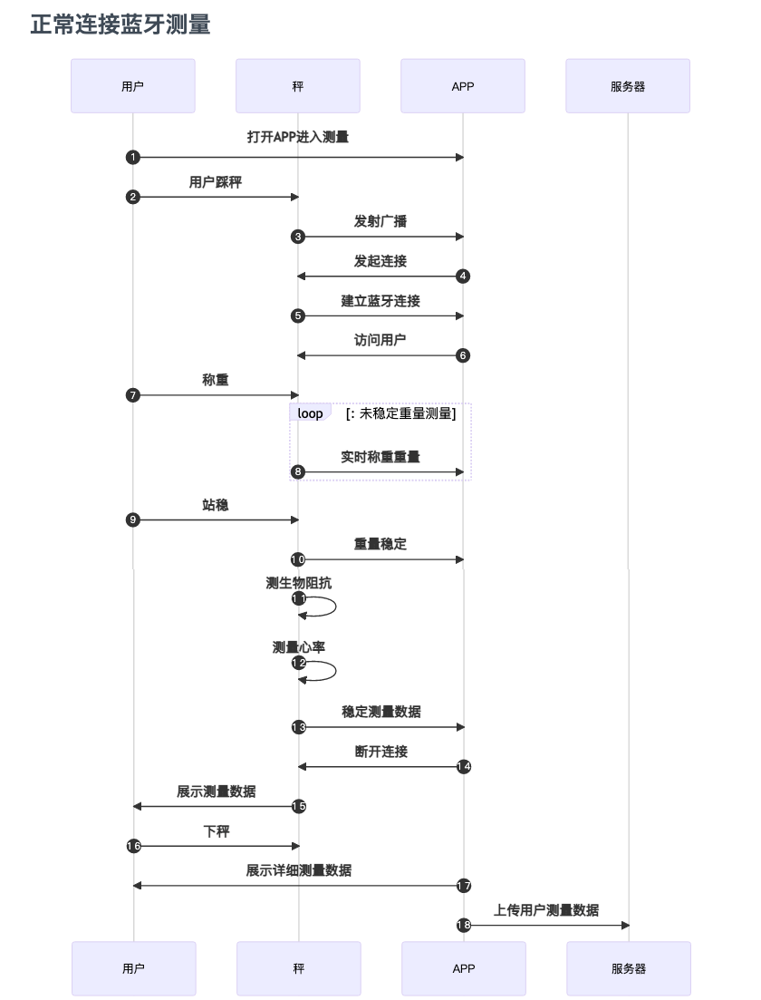
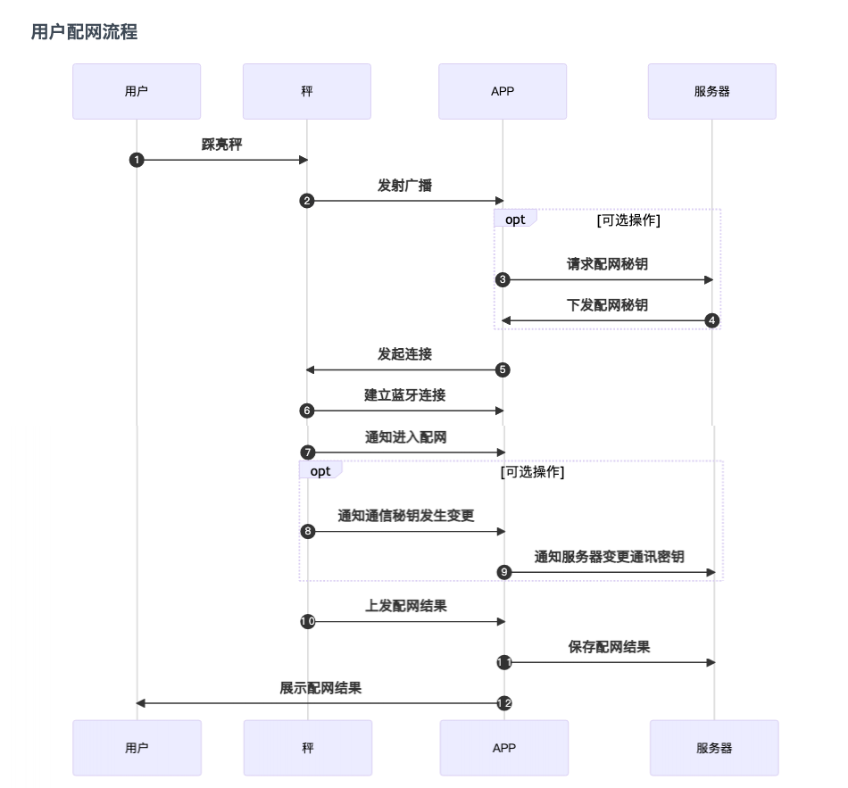
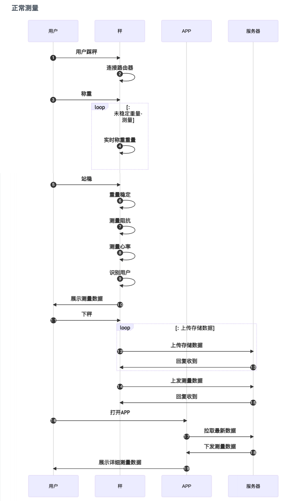
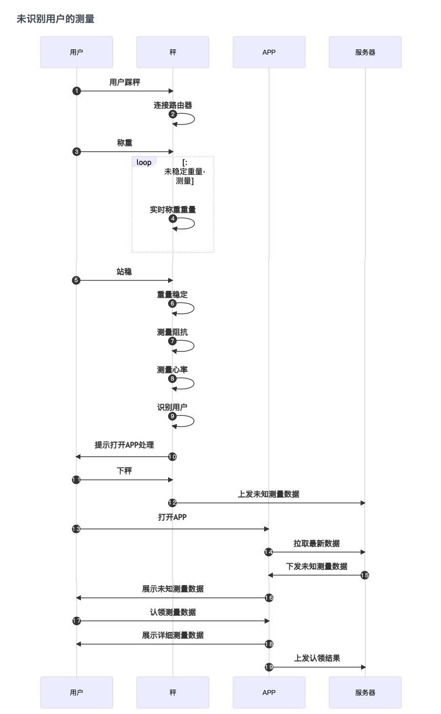

# WSP 蓝牙 WiFi 秤

WSP 蓝牙 WiFi 秤是我司推出的一款支持直接在秤显示屏上展示测量结果智能设备。在将设备连接网络后，上秤测量，测量完成后秤会自动将用户测量数据上传至对应服务器,在用户下次打开APP时就可以看到自己测量数据,提升用户体验。

## 使用测量简述

在秤与APP通过蓝牙连接后,APP向秤输送本次测量用户的基本信息。本次测量完成时，秤端会显示本次测量结果并将测量数据详情上传到APP中。测量用户信息的存在时间为从连接到断开，当设备断开连接时用户信息即销毁。

目前 WSP 设备最多允许 8 个用户，秤端的用户需要通过蓝牙连接的方式向设备注册用户。当注册满 8 个用户后，再次向设备注册用户时，秤端会返回注册失败的状态。因此建议您注册用户之前，先判断是否需要删除秤中的无效用户，以避免无效用户占据资源。

当向设备注册用户时，注册成功时，设备会记录该用户秘钥同时返回该用户的唯一序列号。因此注册该用户成功后，app 需要将设备返回该用户的序列号保存起来。当通过蓝牙连接更新用户资料或用户通过蓝牙连接测量时，需要先使用用户序列号访问秤端的指定用户成功后才能进行。同时序列号也是作为设备上传测量数据属于哪个注册用户的标识，以及作为删除用户的必要条件。

- 注册用户

  秤端能缓存已经注册的用户信息，通过已经注册的用户信息识别未连接蓝牙时的测量数据属于哪个用户，从而使用识别到的用户信息获取详细测量数据

- 访问用户

  对秤进行操作时都需要先访问已注册的用户，访问成功后才能进相应的操作，比如修改用户信息、连接蓝牙进行测量等

## 访客模式测量

访客模式是秤体提供的一个公共通道的测量方式，该方式无需注册用户直接使用，访客模式使用的是临时用户，该用户的存在时间为从连接到断开，当设备断开连接时临时用户即销毁，同时在访客模式下不会产生与接收存储数据

## WSP 设备协议简述

wsp 设备的协议是在[WSP 官方协议](../attouched_list/WSP_v1.0.0.pdf)的基本上进行优化修改而成。wsp 协议交互比较复杂，以下是该设备协议涉及的部分

协议涉及的方面：
- 用户方面
  - 年龄
  - 身高
  - 性别
- 测量方面
  - 测量状态
  - 实时体重
  - 存储数据
  - 测量数据
- 配网方面
  - WiFi 名称
  - WiFi 密码
  - 数据上传地址
  - 配网结果
- 其他
  - 单位

该设备的涉及的方面比较多，并且协议之间的通讯过程以及使能方式都要严格的要求，我司目前已经将其封装成 SDK 方便接入使用。

## 不同情况下的工作流程

- 用户首次使用


- 连接蓝牙的测量



- 配网流程



- WiFi模式下正常测量



- WiFi模式下未识别用户的测量

 

## 一、初始化

使用[QNBleApi.initSdk](../api/QNBleApi.md#initSdk)进行初始化

## 二、扫描

### 1. 设置蓝牙扫描回调监听类

在扫描前，需要设置监听类，方法为[QNBleApi.setBleDeviceDiscoveryListener](../api/QNBleApi.md#setbledevicediscoverylistener)，该方法只需要调用一次即可，在确定不需要扫描记得设置为 null/nil

android 示例：

```java
QNBleApi.getInstance(context).setBleDeviceDiscoveryListener(new QNBleDeviceDiscoveryListener() {
    @Override
    public void onDeviceDiscover(QNBleDevice device) {
        //该方法回调设备对象，可以设备对象进行处理
    }

    @Override
    public void onStartScan() {
        //开始扫描的回到
    }

    @Override
    public void onStopScan() {
        //结束扫描的回到
    }

    @Override
    public void onScanFail(int code) {
        //扫描失败的回调，会有错误码返回，具体可以参考 错误码详情页
    }
});
```

iOS 示例：

```
//设置代理
QNBleApi *bleApi = [QNBleApi sharedBleApi];
bleApi.discoveryListener = self;

//实现代理方法
- (void)onDeviceDiscover:(QNBleDevice *)device {
    //该方法会在发现设备后回调
}

- (void)onStopScan {
    //停止扫描时回调
}

- (void)onStartScan {
    //开始扫描时回调
}
```

### 2. 启动扫描

确认蓝牙已打开，安卓这边还需要检查下`定位权限`和`定位开关`。如果确认蓝牙已打开，定位权限已授权，定位服务开关已打开，则可以开始蓝牙扫描

> 安卓 6.0 以后，对 targetSdkVersion>=23 以上的 APP，进行蓝牙扫描需要获取定位权限，详细说明查看[关于](https://developer.android.com/guide/topics/connectivity/bluetooth-le)
> 定位服务开关不是强制性的，但是某些手机不打开这个开关，也无法扫描到设备，跟各家的手机系统相关

> iOS13 系统增加了蓝牙使用权限，需要检查是否有使用权限，确认已授权并且蓝牙已打开的情况下，开始扫描

扫描方法为[QNBleApi.startBleDeviceDiscovery](../api/QNBleApi.md#startbledevicediscovery)，扫描到的设备数据，会在上面设置的扫描接口中[QNBleDeviceDiscoveryListener](../api/QNBleDeviceDiscoveryListener.md)回调。

另外有关扫描的一些特性设置，可以在[QNConfig](../api/QNConfig.md)进行设置，需要设置的内容已基本覆盖。

> 通常 APP 会有个专门用于测量的界面，我们一般是在界面显示之后进行蓝牙扫描，界面消失的时候停止扫描。

android 示例：

```java
QNBleApi.getInstance(context).startBleDeviceDiscovery(new QNResultCallback() {
            @Override
            public void onResult(int code, String msg) {
                //该方法并不回到设备，而是表示扫描是否启动成功
                if (code != CheckStatus.OK.getCode()) {
                   ToastMaker.show(ScanActivity.this,code+":"+msg);
                }
            }
        });
```

iOS 示例:

```
//启动扫描
[[QNBleApi sharedBleApi] startBleDeviceDiscovery:^(NSError *error) {
    //该处回调表示启动扫描方法是否成功
    if (error) {
        NSLog([NSString stringWithFormat:@"启动扫描方法失败,原因: %@",error]);
    }
}];
```

## 三、连接

收到回调设备后，可以判断是否为需要连接的设备（这个属于 APP 的业务逻辑），如果是的话就进行连接。

连接之前，需要先设置连接状态回调和测量数据回调。

设置连接状态回调方法为：[QNBleApi.setBleConnectionChangeListener](../api/QNBleApi.md#setbleconnectionchangelistener)，该方法同设置扫描回调方法一样，多次连接也只需要设置一次，如果确定不再需要连接的时候，则设置为 null/nil

设置蓝牙状态回调后，还需要设置测量数据的回调接口，方法为：[QNBleApi.setDataListener](../api/QNBleApi.md#setdatalistener)，同样也是设置一次即可，不再使用时，请设置为 null/nil

android 示例：

```java
QNBleApi.getInstance(context).setDataListener(new QNScaleDataListener() {
    @Override
    public void onGetUnsteadyWeight(QNBleDevice device, double weight) {
        //该方法是收到了不稳定的体重数据，一次测量中，该方法会回调多次，直到数据稳定，拿到完整数据.
    }

    @Override
    public void onGetScaleData(QNBleDevice device, QNScaleData data) {
        //该方法是收到了完整的测量数据
    }

    @Override
    public void onGetStoredScale(QNBleDevice device, List<QNScaleStoreData> storedDataList) {
        //该方法是收到了秤端存储数据，存储数据的处理方式可以参考demo，也可以自己定义
    }

    //测量过程中的连接状态
    @Override
    public void onScaleStateChange(QNBleDevice device, int status) {
        setBleStatus(status);
    }
});
```

iOS 示例：

```
- (void)onGetUnsteadyWeight:(QNBleDevice *)device weight:(double)weight {
    //该方法是收到了不稳定的体重数据，一次测量中，该方法会回调多次，直到数据稳定，拿到完整数据
}

- (void)onGetScaleData:(QNBleDevice *)device data:(QNScaleData *)scaleData {
    //该方法是收到了完整的测量数据
}

- (void)onGetStoredScale:(QNBleDevice *)device data:(NSArray <QNScaleStoreData *> *)storedDataList {
    //该方法是收到了秤端存储数据，存储数据的处理方式可以参考demo，也可以自己定义
}

- (void)onScaleStateChange:(QNBleDevice *)device scaleState:(QNScaleState)state {
    //测量过程中的连接状态
}

- (void)onScaleEventChange:(QNBleDevice *)device scaleEvent:(QNScaleEvent)scaleEvent {
    //设备事务的回调
}

```

另外，调用连接前，最好把之前的扫描给停止（我们发现部分手机同时蓝牙扫描和蓝牙连接，会降低连接成功的失败率）。停止扫描后，延迟个 200~500ms 再调用连接，会提升连接的成功率。
停止蓝牙扫描的方法为：[QNBleApi.stopBleDeviceDiscovery](../api/QNBleApi.md#stopbledevicediscovery)。

android 示例：

```java
QNBleApi.getInstance(context).stopBleDeviceDiscovery(new QNResultCallback() {
    @Override
    public void onResult(int code, String msg) {
        if (code == CheckStatus.OK.getCode()) {
            isScanning = false;
        }
    }
});
```

iOS 示例：

```
[[QNBleApi sharedBleApi] stopBleDeviceDiscovery:^(NSError *error) {
    //该处回调表示停止扫描方法是否成功
    if (error) {
        NSLog([NSString stringWithFormat:@"停止扫描方法失败,原因: %@",error]);
    }
}];
```

连接设备的方法需要传Yolanda蓝牙设备对象([QNBleDevice](../api/QNBleDevice.md))以及Yolanda用户资料对象（[QNUser](../api/QNUser.md)），其中[QNBleDevice](../api/QNBleDevice.md)[QNUser](../api/QNUser.md)的创建方法为：[QNBleApi.buildUser](../api/QNBleApi.md#builduser)，具体使用方法可以参考方法说明。

前面的操作确认 OK 后，终于可以进行连接了，连接的方法为：[QNBleApi.connectDevice](../api/QNBleApi.md#connectDevice)。连接状态回调方法为上述[QNBleConnectionChangeListener](../api/QNBleConnectionChangeListener.md)

android 示例：

```java
 QNWspConfig qnWspConfig = new QNWspConfig();
    //.......进行配置设置
    mQNBleApi.connectDevice(device, user, new QNResultCallback() {
        @Override
        public void onResult(int code, String msg) {
            QNLogUtils.log("WspScaleActivity", "wifi 配置code:" + code + ",msg:" + msg);
        }
    });
```

iOS 示例：

```
    //设置wsp设备的操作配置
    QNWspConfig *config = [[QNWspConfig alloc] init];
    [[QNBleApi sharedBleApi] connectDevice:device user:user callback:^(NSError *error) {

    }];
```

## 称重过程

称重过程的数据以及状态会在上述提到的[QNScaleDataListener](../api/QNScaleDataListener.md)中进行回调

## 测量结束

收到稳定数据后（即收到[QNScaleDataListener.onGetScaleData](../api/QNScaleDataListener.md#ongetscalesata)）即表示测量完成，当测量完成后，设备会自动断开连接。

至此，设备的基本流程已经走完，APP 可以在收到稳定数据后自行保存数据和展示数据。数据标准判断可以我司的方式-[SDK 指标标准描述](../attouched_list/SDK指标标准描述.pdf)。
