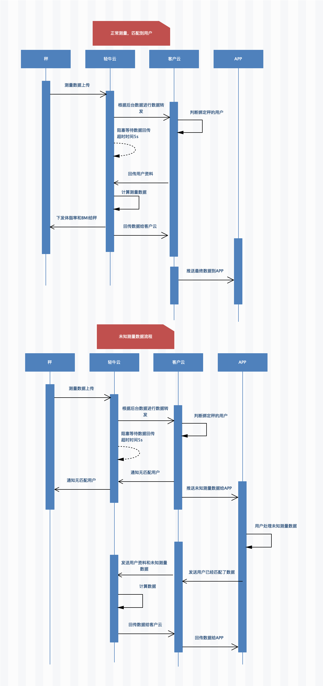

# 双模秤接入引导

## 介绍

这里所说的`双模秤`是指带有 WiFi 和蓝牙这两种数据传输功能的体脂秤

## 作用

### 蓝牙

用来设置 WiFi 的 ssid 和密码

用来称重时的数据传输

### WiFi

称重数据传输

## WiFi 使用流程

### 首次使用

首次使用时

#### 1. 扫描设备

调用普通蓝牙秤的 API，扫描到轻牛蓝牙设备（QNBleDevice）,并判断 deviceType 等于`SCALE_WIFI_BLE`

#### 2. 注册设备

WiFi 设备需要跟服务器进行注册，调用 API [向轻牛云注册 WiFi 蓝牙双模设备](./api/QNBleApi.md#registerwifibledevice)

> 该方法需要网络，请确保该方法执行成功，否则云端无法收到我司云端转发的测量数据
> 该方法执行多次无不良影响

#### 3. 配置 WiFi

出厂时秤端未保存 WiFi 的 ssid 和密码，此时需要调用蓝牙的相关 APP 给秤端进行配网

> 配网 API 请查看[对 WiFi 蓝牙双模设备进行配网](./api/QNBleApi.md#connectdevicesetwifi)

## 4. 编写网络接口

提供客户云端服务器的地址前缀，比如：http://www.baidu.com/scale/

> 下面统称我们公司服务器为:轻牛云，客户的服务器为：商家云

### 询问用户资料接口

#### 场景

前置条件：秤已经成功注册，秤已经配网，测量时没有连接蓝牙

此时数据会通过 WiFi 上传到轻牛云，然后轻牛云会把体重和测量时间等相关信息转发给商家云。

此时商家云需要在服务中查询绑定了该设备的用户，并把用户资料回传给轻牛云，然后轻牛结合用户资料进行计算再把数据通过[推送测量数据服务](#推送测量数据服务)

#### 基本

接口地址：前缀+user_info ，示例：地址是 http://www.baidu.com/scale/user_info 其中`user_info`是在提供的接口地址前缀追加的

请求方法：`GET`

> 通知交互时，如果轻牛收到合作方的应答不是成功或超时，轻牛认为通知失败，轻牛会通过一定的策略定期重新发起通知，尽可能提高通知的成功率，但轻牛不保证通知最终能成功。 （通知频率为 15/30/180/1800/3600，单位：秒）
> 另外，一般情况下应答成功后不会再次发送，失败情况下同样的通知可能会多次发送给合作方系统。合作方系统必须能够正确处理重复的通知。

#### 请求参数

| 字段名   | 变量名       | 必填   | 类型                | 示例值 | 描述 |
| :------- | :----------- | :----- | :------------------ | :----- | :--- |
| 体重     | weight       | Double | 58.8                | kg     |
| 测量时间 | measure_time | Data   | 2019-04-29 15:21:18 |        |
| mac      | mac          | String | F0:FE:6B:CB:75:6A   |        |
| 型号 ID  | model_id     | String | 0000                |        |
| 签名     | sign         | String |                     |        |

#### 返回数据

| 字段名     | 变量名          | 必填 | 类型   | 示例值        | 描述 |
| :--------- | :-------------- | :--- | :----- | :------------ | :--- |
| 返回状态   | status          | 是   | String | 200           |      |
| 身高       | height          | 是   | Double | 176.7         | cm   |
| 性别       | gender          | 是   | int    | 0/1 0 女 1 男 |      |
| 生日       | birthday        | 是   | Data   | 1986-01-01    |      |
| 体型       | user_shape      | 否   | int    | 3             |      |
| 目标       | user_goal       | 否   | int    | 4             |      |
| 衣服重量   | clothing_weight | 否   | Double | 1.2           | kg   |
| 是否运动员 | sport_flag      | 否   | int    | 0/1 0 否 1 是 |      |
| 用户标识   | user_id         | 是   | String | 1001          |      |

示例如下：

```json
{
  "status": "20000",
  "user_info": {
    "height": 160.0,
    "gender": 0,
    "birthday": "1986-01-01",
    "user_shape": 0,
    "user_goal": 0,
    "clothing_weight": 0,
    "sport_flag": 0
  }
}
```

如果没有匹配到用户，则无 user_info 这个 key

### 推送测量数据服务

#### 场景

轻牛云在收到商家云回传的用户资料后，会计算体质数据，然后通过该接口，把数据推送至商家云

#### 基本

接口地址：前缀+measure ，示例：地址是 http://www.baidu.com/scale/measure 其中`measure`是在提供的接口地址前缀追加的

请求方法：`GET`

> 通知交互时，如果轻牛收到合作方的应答不是成功或超时，轻牛认为通知失败，轻牛会通过一定的策略定期重新发起通知，尽可能提高通知的成功率，但轻牛不保证通知最终能成功。 （通知频率为 15/30/180/1800/3600，单位：秒）
> 另外，一般情况下应答成功后不会再次发送，失败情况下同样的通知可能会多次发送给合作方系统。合作方系统必须能够正确处理重复的通知。

#### 请求参数

| 字段名     | 变量名     | 必填 | 类型   | 示例值                | 描述                     |
| :--------- | :--------- | :--- | :----- | :-------------------- | :----------------------- |
| 合作方 ID  | partner_id | 是   | String | qn888888              | 轻牛分配的合作方 ID      |
| 状态码     | code       | 是   | String | 20000                 | 成功/失败                |
| 返回信息   | msg        | 否   | String | success/fail          | 成功或错误的具体描述     |
| 指标内容   | resultData | 是   | String | JSON 格式数据，见下表 | 测量的指标具体信息       |
| 随机字符串 | nonce_str  | 是   | String | 067428733252          | 随机字符串，不超过 32 位 |
| 签名       | sign       | 是   | String | JSON 格式             | 签名，详见签名算法       |

| 字段名   | 变量名         | 必填     | 类型   | 示例值              | 描述                         |
| :------- | :------------- | :------- | :----- | :------------------ | :--------------------------- |
| 状态码   | code           | 是       | String | 20000               | 成功/失败                    |
| 用户标识 | user_id        | 是       | String | qn888888            | 轻牛分配的合作方 ID          |
| 状态码   | code           | 是       | String | 20000               | 成功/失败                    |
| 返回信息 | msg            | 否       | String | success /fail       | 成功或错误的描述             |
| 测量时间 | measurement_at | 是       | String | 2019-04-30 15:48:53 | 测量的指标具体信息           |
| mac      | mac            | 是       | String | F0:FE:6B:CB:75:6A   |                              |
| 型号     | ID             | model_id | 是     | String              | 0000                         |
| 指标数组 | item_list      | 是       | String | 数组格式            | type: 指标常量 value: 指标值 |

示例如下

```
{
"code" : "20000", "msg" : "success", "partner_id" : "ade2e33efefdvdf", "resultData" : "{\"measurement_at\":\"2019-04-30 18:22:53\",\"user_id\":1001,
\"mac\":\"F0:FE:6B:CB:75:6A\",\"model_id\":\"0005\",
\"item_list\":[{\"type\":1,\"value\":25.35},{\"type\":2,\"value\":9.9},{\"type\":3,\"value\":5.1},{\"type\":4,\"value\":4.7},{\"type\":5,\"value\":1},{\"type\":6,\"value\":74.5},{\"type\":7,\"value\":63.2},{\"type\":8,\"value\":16.5},{\"type\":9,\"value\":90.0},{\"type\":11,\"value\":13.7},{\"type\":16,\"value\":93}]}",
"nonce_str" : "067428733252",
"sign" : "ef2b9e9a4dc03f764e033947859dedd3"
}
```

#### 返回参数

返回 success/fail 即可

### 签名算法

轻牛和合作方系统之间的数据交互都会加上数字签名,目前只支持 MD5 方式,签名时需要使用入驻轻牛时分配的 secret(入驻轻牛时会分配一对 partner_id /secret, 其中
secret 是用来签名的，请妥善保管好轻牛分配的密钥)
参与签名的参数：轻牛请求参数列表中,除去 sign 参数外,其他需要使用到的参数皆是要签名的参数。
签名生成的步骤如下：

1. 把 这些参数放入一个 Map 中,去除签名参数:sign(签名)
1. 把 剩余的参数按照 key 的字母升序排序(从 a 到 z 的顺序排序,若遇到相同首字母,则看第二个字母,以此类推)
1. 排序完成之后,按 key&value 键值对格式连接成一个字符串 stringA,去掉 value 为空的数据。
1. 把上面的字符串在后面拼接上分配的 secret 组成新的字符串
1. 使用 MD5 对组装好的字符串签名,验证签名是否为参数中的 sign。

特别注意以下重要规则：

1. 如果参数的值为空不参与签名；
2. 验证调用返回或主动通知签名时，传送的 sign 参数不参与签名，将生成的签名与该 sign 值作校验。
3. 轻牛接口可能增加字段，验证签名时必须支持增加的扩展字段

示例：
请求的参数：

```json
{
  "partner_id": "1111",
  "user_code": "921026",
  "nonce_str": "11eeewwwwwq112s",
  "sign": "a328c2ec0a60cbbc9961a1189f61e97b"
}
```

拼接：
stringA = “nonce_str=11eeewwwwwq112s&partner_id=1111&user_code=921026”
拼接上 secret ：ekskdsd8sd88s833 后 "nonce_str=11eeewwwwwq112s&partner_id=1111&user_code=921026ekskd sd8sd88s833"
MD5 签名值：
a328c2ec0a60cbbc9961a1189f61e97b

## WIFI 数据交互时序示意图


